# 第一章

## And(及閘)
●由兩個Nand閘形成一個閘，各有二個輸入端及一個輸出端。(根據圖片)

●當兩個輸入端都為1時，輸出則為1；否則，輸出為0。

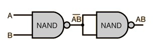

## And16
●共有16個And閘形成，每個And閘各有二個輸入端及一個輸出端，當所有輸入都為1時，輸出才為1；否則，輸出為0。(根據圖片)

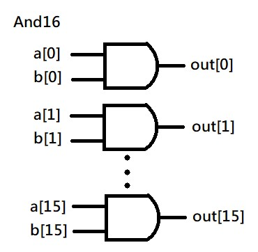

## DMux(解多工器)
●基本功能是根據控制信號的狀態，將單一的輸入數據流路由到多個輸出端口之一。

以下圖片是1對4的解多工器
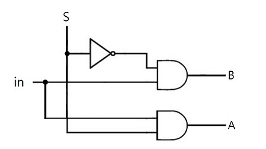

[影片參考連結](https://youtu.be/hgXKitizAto?feature=shared)

## DMux4Way
●是一種四路解多工器的形式。

●共有四個輸入端(DMux各兩個)，兩個控制端(sel[0]、sel[1])，一個輸出端。(根據圖片)

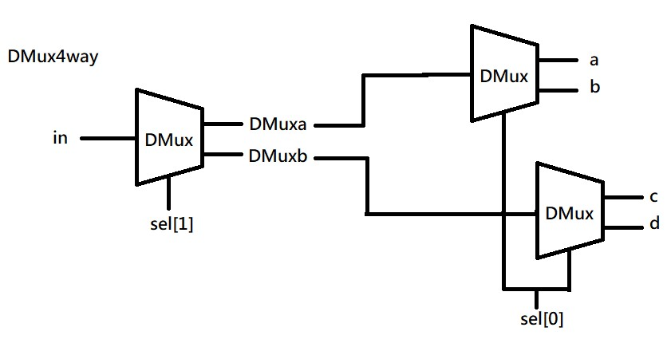

## DMux8Way
●DMux4Way各有四個輸入端，兩個控制端(sel[0]、sel[1])，之後Dmux有一個輸出端及一個控制台(sel[2])。(根據圖片)

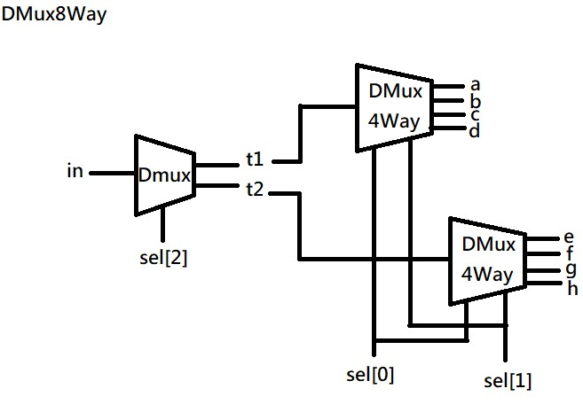

## Mux
●是一種數位電路元件，用於將多個輸入數據流選擇性地輸出到一個輸出端。

●有兩個And閘，輸入端各有兩個(其中一個是由Not閘形成)，之後Or閘有一個輸出端。(根據圖片)

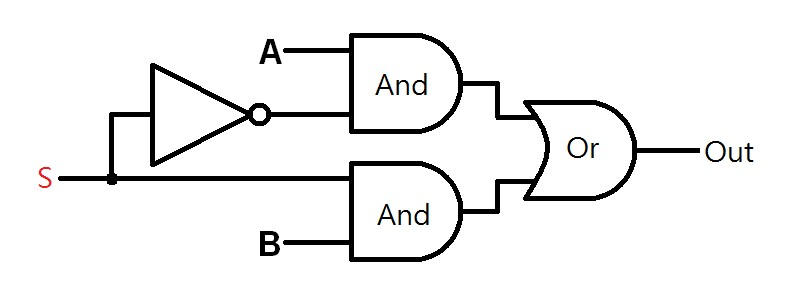

## Mux4Way16
●每個 Mux16 有兩個輸入端口，及一個控制端(sel[0]和sel[1])，最後的Mux16有一個輸出端。(根據圖片)

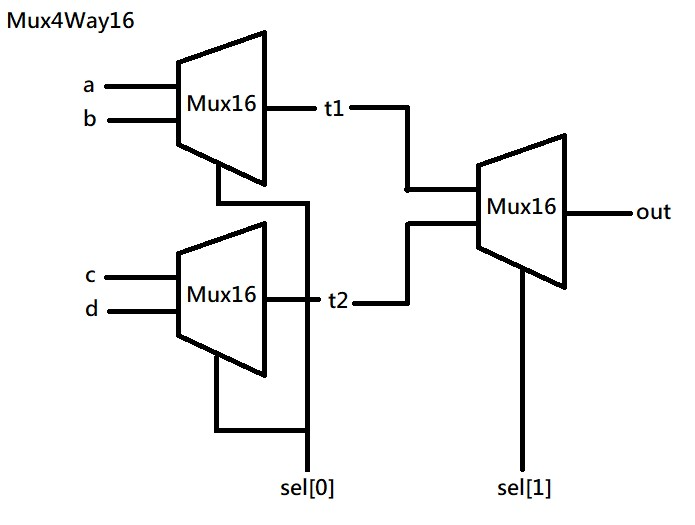

## Mux8way16
●每個Mux4Way16有4個輸出端，兩個控制端(sel[0]、sel[1])，最後Mux16有一個輸出段，一個控制端(sel[2])。(根據圖片)

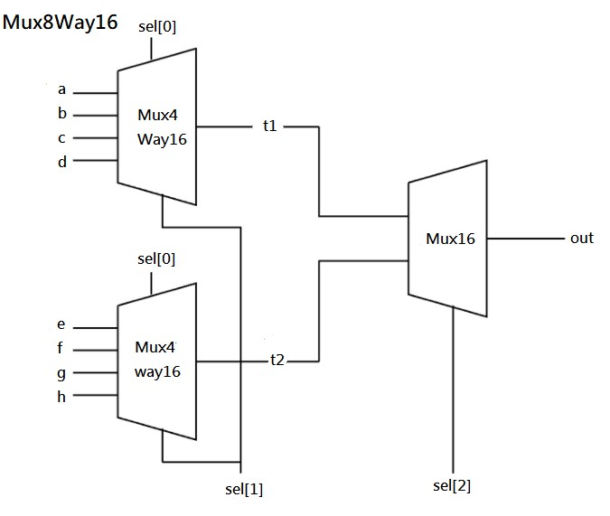

## Mux16
●有16個Mux,每個Mux都有二個輸出端，一個控制台，一個輸出端(根據圖片)

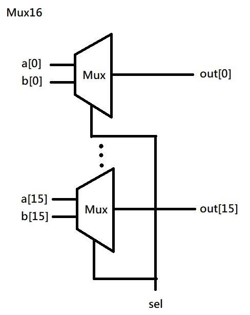

## Not
●可以由Nand形成，共一個輸入端，一個輸出端。
(根據圖片)

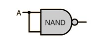

## Not16
●由16個Not閘形成，各有一個輸入端和一個輸出端。(根據圖片)

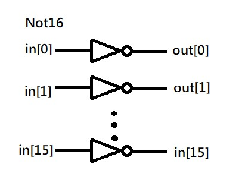

## Or
●由三個Nand閘形成Or閘，各有兩個輸入端，一個輸出端。(根據圖片)

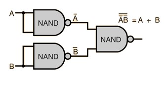

## Or8Way
●每個Or各有二個輸入端，一個輸出端。(根據圖片)

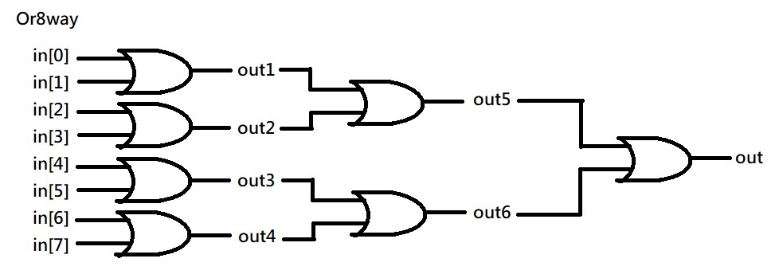

## Or16
●共16個Or閘形成，每個Or閘各有兩個輸入端一個輸出端。(根據圖片)

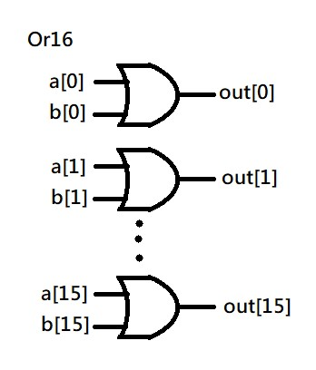

## Xor
●由Or和Nand及And形成，各有兩個輸入端和一個輸出端。

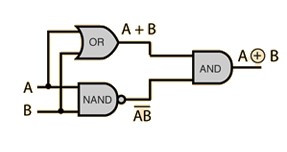