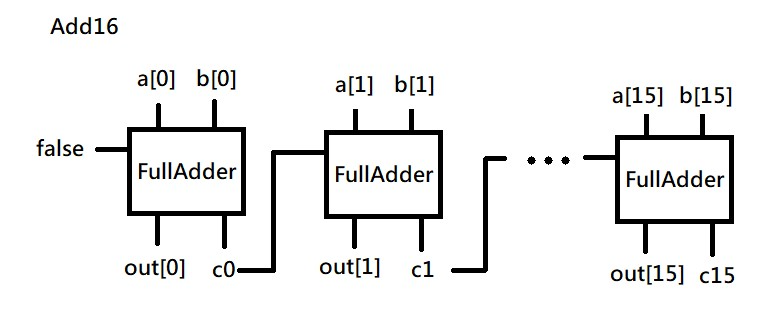
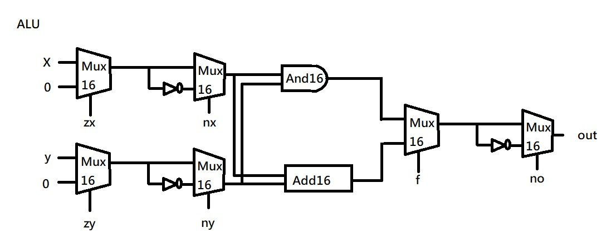
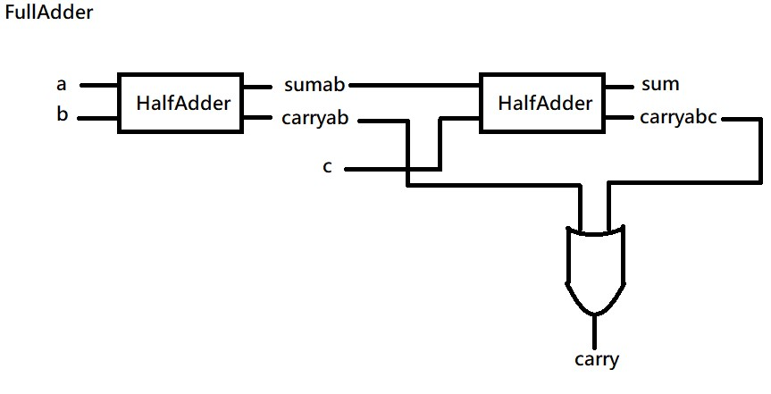
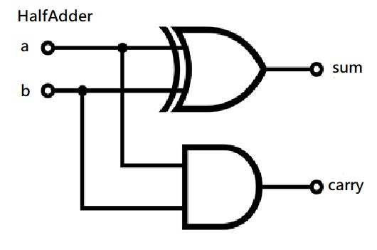
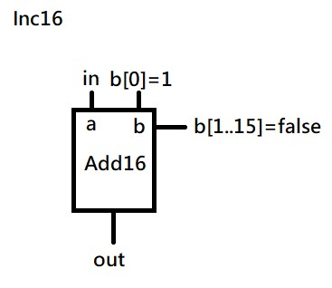

# 第二章

## Add16
●由16個FullAdder形成Add16，每個FullAdder都有兩個輸入，一個輸出和Cin。第一個Cin(c0)不需要考慮來自低位的進位，所以直接設為False。(根據圖片)

## ALU
●由六個Mux16和一個And16、一個Add16形成。

●Mux16用於選擇X、Y或not結果作為輸入信號。

●And16和Add16都是邏輯電路，可以執行邏輯與和加法運算。在 ALU 中，And16 用於執行邏輯與運算，Add16 用於執行加法運算。

## FullAdder
●由HalfAdder和Or組成。

●因為FullAdder是一個用於二進位加法的組合邏輯電路，所以有三個輸入(a、b、cin)和兩個輸出(sum、carry-out)。

## HalfAdder
●由一個Or和一個And組成。

●有兩個輸入(a、b)和一個輸出(Or-sum，And-carry)。

## Inc16
●由Add16形成的，有三個輸入(a、b、cin)，還有一個輸出。

●Inc16具有加一的功能，其中a和b是要相加的輸入，而cin表示進位。輸出out是加一後的结果。

