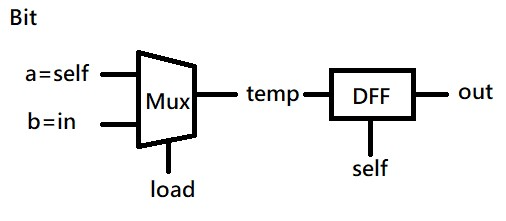
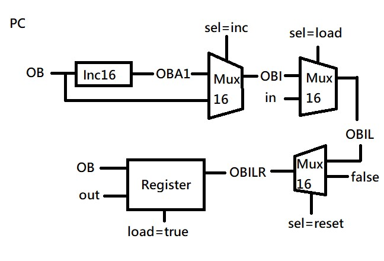
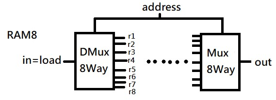
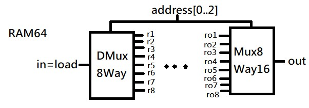
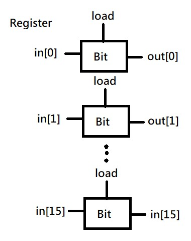

# 第三章(A)

## Bit
●由Mux和DFF(D型觸發器)形成。
Mux選擇輸入信號，DFF儲存狀態。

●Mux的輸入信號a、b和cin分別連接到Mux的輸入端。 Mux 的輸出連接到 DFF 的輸入端。DFF 的輸出就是位元的輸出。

## PC(Program Counter)
●用於儲存程式指令地址的邏輯電路。

●由Inc16( 可以用來將PC的值加1 )、Mux16( 輸入信號是PC的值和指令地址 )、Register( 輸入信號是 Mux16 的輸出 )。形成。

## RAM8
●由DMux8Way和Mux8Way形成。

●DMux8Way有一個輸入(in)，八個輸出(r1~r8)，及address(數據寫入的目標位置)。

●Mux8Way有8個輸入(r1~r8)，一個輸出(out)，及address(讀取數據的位置)。

## RAM64
●由DMux8Way和Mux8Way16形成。

●DMux8Way有一個輸入(in)，八個輸出(r1~r8)，及address\[ 0..2\]
(數據寫入的目標位置)。

●Mux8Way16有8個輸入(ro1~ro8)，一個輸出(out)，及address\[ 0..2\](確定讀取或寫入數據的目標位置)。

## Register
●由Bit形成，每個Bit各有一個輸入，一個輸出，和一個控制信號(load)。

