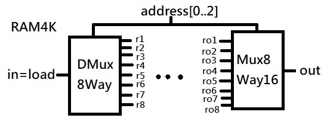
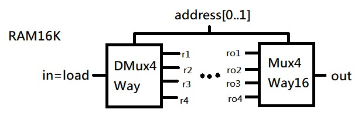
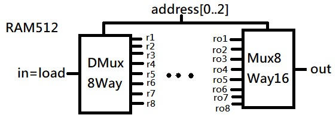

# 第三章(B)

## RAM4K
●由DMux8Way和Mux8Way16形成。

●DMux8Way有一個輸入(in)，八個輸出(r1~r8)，及address\[ 0..2\]
(數據寫入的目標位置)。

●Mux8Way16有8個輸入(ro1~ro8)，一個輸出(out)，及address\[ 0..2\](確定讀取或寫入數據的目標位置)。

## RAM16K
●由DMux4Way和Mux4Way16形成。

●DMux4Way有一個輸入(in)，四個輸出(r1~r4)，及address\[ 0..1\]
(數據寫入的目標位置)。

●Mux4Way16有8個輸入(ro1~ro4)，一個輸出(out)，及address\[ 0..1\](確定讀取或寫入數據的目標位置)。

## RAM512
●由DMux8Way和Mux8Way16形成。

●DMux8Way有一個輸入(in)，八個輸出(r1~r8)，及address\[ 0..2\]
(數據寫入的目標位置)。

●Mux8Way16有8個輸入(ro1~ro8)，一個輸出(out)，及address\[ 0..2\](確定讀取或寫入數據的目標位置)。

